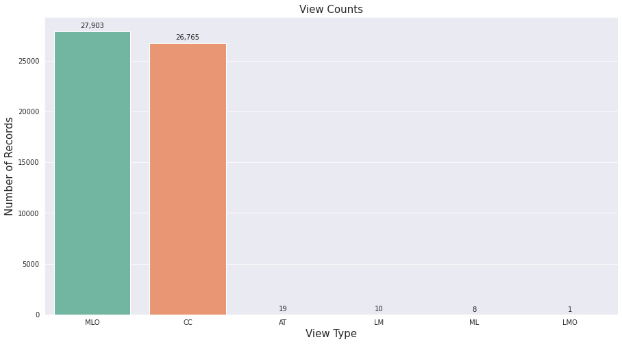
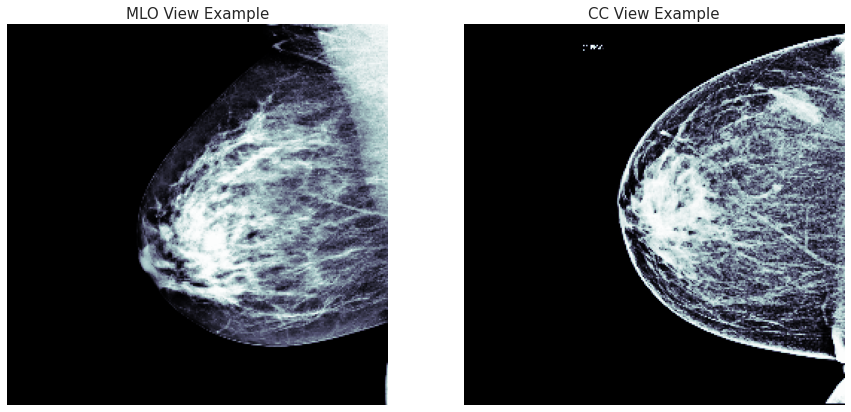
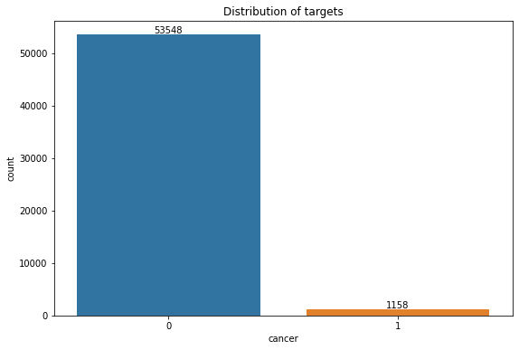

***Goal of the Competition***
The goal of this competition is to identify breast cancer. You'll train your model with screening mammograms obtained from regular screening.

Your work improving the automation of detection in screening mammography may enable radiologists to be more accurate and efficient, improving the quality and safety of patient care. It could also help reduce costs and unnecessary medical procedures.

# Table of contents
1. [Overview](#overview)   
    .....Context  
2. [Data Analysis](#analysis)  
    .....Overview  
    .....Key observation  
    .....Key observations about METADATA  
    .....View Features  
    .....Age Distribution  
    .....Label distribution  
3. [Methods](#method)

# 1.Overview: 

## Context
According to the WHO, breast cancer is the most commonly occurring cancer worldwide. In 2020 alone, there were 2.3 million new breast cancer diagnoses and 685,000 deaths. Yet breast cancer mortality in high-income countries has dropped by 40% since the 1980s when health authorities implemented regular mammography screening in age groups considered at risk. Early detection and treatment are critical to reducing cancer fatalities, and your machine learning skills could help streamline the process radiologists use to evaluate screening mammograms.

Currently, early detection of breast cancer requires the expertise of highly-trained human observers, making screening mammography programs expensive to conduct. A looming shortage of radiologists in several countries will likely worsen this problem. Mammography screening also leads to a high incidence of false positive results. This can result in unnecessary anxiety, inconvenient follow-up care, extra imaging tests, and sometimes a need for tissue sampling (often a needle biopsy).

The competition host, the Radiological Society of North America (RSNA) is a non-profit organization that represents 31 radiologic subspecialties from 145 countries around the world. RSNA promotes excellence in patient care and health care delivery through education, research, and technological innovation.

Your efforts in this competition could help extend the benefits of early detection to a broader population. Greater access could further reduce breast cancer mortality worldwide.

"kaggle: RSNA Screening Mammography Breast Cancer Detection"

# 2. Data Analysis: 

The dataset has 2 main parts:
* Image files
* Metadata
    
**Overview:**
* There are 54,706 training samples to work with, each containing 14 features.
    * There are only 2 different sites where imaging took place.
    * Of the 54,706 training samples, there are 11,913 unique patients, meaning that patients are represented multiple times.
    * There are 10 different machines that performed imaging.
* There are 4 testing samples to work with, each containing 9 features.

**Key observations**

* The testing set only contains 4 samples. 
* The testing set contains a "prediction_id" column that is not present in the training set.
* There are 5 features in the training set that don't appear in the testing set. There may be an opportunity here to use soft labeling to predict those features that don't appear in the testing set to help us with the classification task, if those features end up being at least partially correlated with the target variable. In particular, we may want to see if we can build classifiers that filter for:
    * biopsy
    * invasive
    * BIRADS
    * density
    * difficult_negative_case - this in particular may be a good starting point for generating a coarse first-pass filter
* Patients are represented multiple times

**Key observations about METADATA**

* Both "CompressionForce" and "BodyPartThickness" measurements may be useful for future investigation. While only observed in half of the image data we have, they still may add information that we can use.
* The "ContentDate" field may have provided us unique insights into when various imaging series have been undertaken. For example, we may have seen the progression of a disease or been able to determine whether a finding was difficult to ascertain based solely upon the date the image was taken. However, the field appears to have been sanitized.
* The number of "BitsStored" varies, meaning we're likely to have different qualities of images depending on the dicom file.
We have a wide variety of Rows and Columns, meaning that image sizes and resolutions are going to be varied. We'll probably need to normalize / standardize the resolution of the images. Need to be wary of generating compression artifacts or of losing information if we do so.
* Two different "PhotometricInterpretation" types are available. Again, we need to be aware this may result in different interpretations when we view the images themselves.
* The "VOILUTFunction" types are different. Briefly, VOI is a Value Of Interest, and LUT is a Look Up Table. VOI LUT functions specify how pixel intensity values should be presented when viewed. The lookup table values may have a non-linear relationship to the intensity value physically encoded in the image. Again, this can impact our perception of the image as we view it. We need to make sure we properly represent the dicom image when we display it or use it in a machine learning process.

**View Features**

We can see from the graph that the images are primarily comprised of two different views:
* **MLO** - Mediolateral Oblique View - captures the most breast tissue. The pectoral muscle is included in the view, and is used as a guide to assess proper patient positioning and overall image quality. The MLO view is taken looking downwards, but angled to look from the center of the chest outwards.
* **CC** -  Craniocaudal View - as with the Mediolateral Oblique View, the pectoral muscle may be included in the view, which again is used as a guide to assess proper patient positioning. The main difference however, is that the Crainocaudal View is taken from above the breast looking straight downwards (i.e. no angle is introduced as in the oblique view).

Both MLO and CC views are known as standard views. These views are the ones most commonly used in routine screening. It is worthwhile to note however, there may be contraindications where these views are not performed, such as when disease processes are present. With patients under 40, only the MLO of the left and right sides may be performed to reduce overall radiation exposure, since it adequately captures the most breast tissue.

In addition to the standard views, there are other significantly less utilized views in the training set, which are separate and distinct from MLO and CC:

* **AT** - Unknown - possibly Tangent View?
* **ML** - Mediolateral View - taken from the center of the chest between the breasts, looking outwards. Usually used in instances where the Mediolateral Oblique View has not been taken or is not possible. This is a favored view when the oblique view is not available, as most disease processes occur on the lateral side of the breast, and therefore will be closer to the film allowing for a clearer image of the pathology.
* **LM** - Lateromedial View - similar to the Mediolateral View, except the view is taken from the arms pointing inwards towards the chest. This view is not as ideal, again due to the tendency for pathology to occur on the lateral side of the breast.
* **LMO** - Lateromedial Oblique View - similar to MLO except taken from the outside of the body pointing inwards.

**Age Distribution**

The patient's age in years. The average age is 58 years old, with the vast majority of the patients having between 50 and 65 years old. There are a few outliers with very young patients (26-30 years old), as well as a few more senior patients (89 years old).

Furthermore, tagehe youngest patient to have cancer is 38 years old, while the mean of those patients is 63 years old.

**Label distribution**

The classes are highly unbalanced which the labeled data is 1158 images.

# 3. Methods 
We have a some solution with distinct approaches:

* Firstly, we can combine metadata and images data to an auxiliary network with:
    * Metadata network could be a neural network with input is metadata
    * Images network (backbone could be Resnet, EfficientNet, EfficinetNet v2, RexNext, ...)
    * Concatenate both output to predict.

* Secondly, we can use the classification model with segmentation header
* Finally, we can use Multi-view Model cause we have muti-view images (MLO view, CC view, AT view, ... )

So, I demonstrate each method, explain the idea, drawback and why it works.